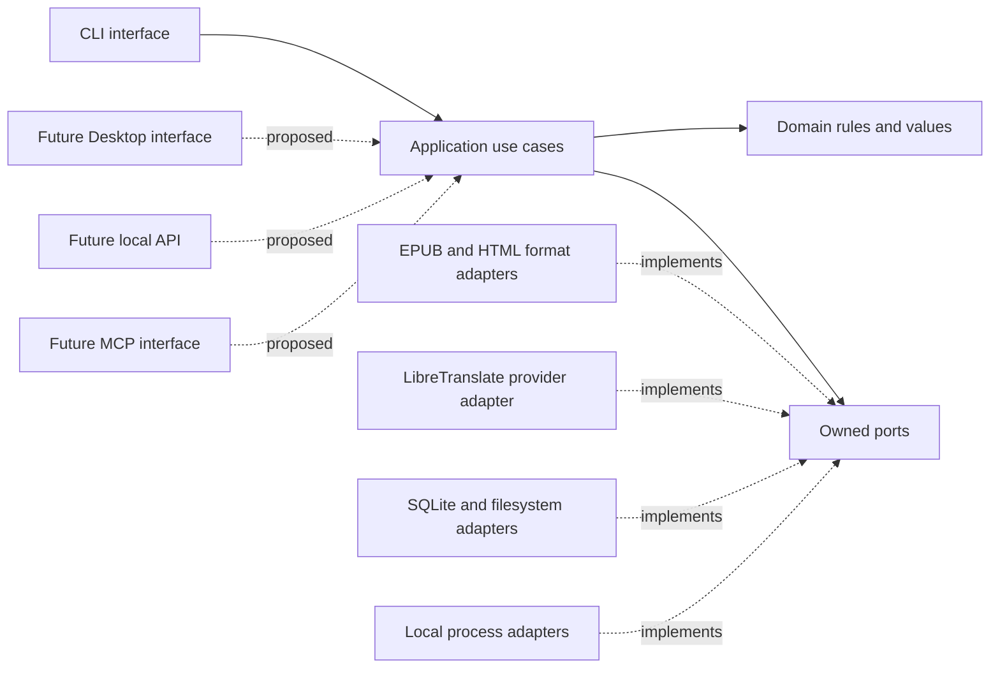
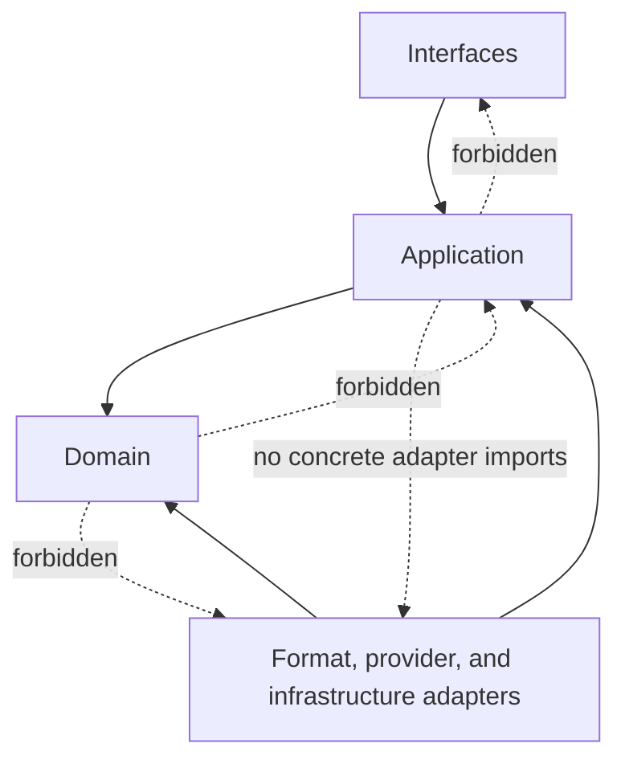
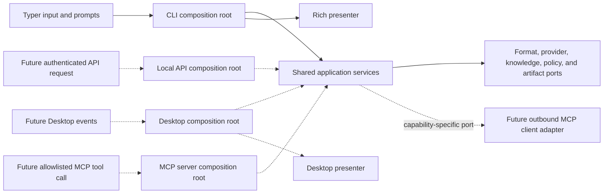

# Modular-monolith boundaries and module ownership

Status: `Accepted`

Date: 2026-09-03

Accepted: 2026-09-03 by `DevStarrk1137` (project maintainer)

Related issue: [#125 — DESKTOP-004](https://github.com/DevStarrk1137/ayvu/issues/125)

## Status and scope

This record establishes the accepted logical ownership and dependency rules for
evolving Ayvu as a local-first modular monolith. Acceptance does not move
production code, enforce imports, add a Desktop framework, or freeze the
illustrative physical package layout. Those changes remain owned by separately
reviewed issues.

The current product is defined by the [product scope](../product-scope.md), its
observable behavior is protected by the
[translation workflow migration baseline](../translation-workflow-migration-baseline.md),
and its interface-neutral operations are catalogued in the
[shared application use-case matrix](shared-use-case-matrix.md). This baseline
organizes those operations without changing them.

## Context

Ayvu currently has a flat `src/ayvu` package. The modules are focused enough to
be testable, but orchestration, presentation, policies, and concrete adapters
still meet directly in several places:

- `cli.py` parses input and renders output while also constructing collaborators
  and coordinating long workflows;
- `epub_io.py` preserves the EPUB archive while also coordinating translation,
  review, and memory collaborators;
- `html_translate.py` combines markup-safe reconstruction with translation
  stages such as cache, chunking, glossary, and translation memory;
- SQLite, JSON, HTTP, subprocess, parser, and terminal types are exposed by
  modules that will eventually implement narrower ports.

Adding another interface directly to these modules would reproduce orchestration
and error handling. Moving files into new directories without first defining
ownership would only hide the coupling. Ayvu therefore needs logical boundaries
that can be introduced one use case at a time while the CLI remains operational.

## Decision drivers and invariants

This decision is driven by the following constraints:

1. CLI, future Desktop, local API, and MCP adapters must invoke the same
   application use cases instead of duplicating business rules.
2. The original EPUB remains immutable, and every preview, translation, review,
   or export is a distinct artifact.
3. Visible-text filtering, markup reconstruction, cache semantics, glossary
   ordering, resume behavior, and archive preservation must survive migration.
4. Domain and application contracts must remain usable without Typer, Rich,
   Qt, requests, ebooklib, Beautiful Soup, SQLite, or an MCP SDK.
5. Filesystem, network, parser, process, persistence, and secret-bearing
   boundaries require explicit ports and policy-aware adapters.
6. Proposed Desktop, provider, format, project, job, and AI concepts must not be
   represented as delivered capabilities.
7. Registries, plugin APIs, and universal format models must not precede the
   concrete adapters that prove their contracts. A second adapter is introduced
   only as a bounded vertical after its dependency gates, and becomes evidence
   for the smallest shared abstraction.

This acceptance records the modular-monolith, inward-dependency, and shared
application-contract decisions represented by `DEC-001`, `DEC-002`, and
`DEC-017`. It does not accept any other proposed architecture decision.

## Architecture dimensions

Layers describe dependency direction. Capability modules describe ownership of
behavior and data. They are separate dimensions: for example, Projects may
expose domain values, application use cases, and repository ports while a
filesystem adapter implements one of those ports. Neither dimension requires an
immediate directory per row.

### Layers and adapter roles

| Layer or role | Owns | Must not contain |
| --- | --- | --- |
| **Domain** | Stable value objects, invariants, identities, state transitions, and policy-neutral rules owned by capability modules | Framework types, persistence, HTTP, parsing, rendering, or use-case orchestration |
| **Application** | Commands, queries, use-case coordination, transaction boundaries, structured outcomes, and calls to inward-owned ports | Typer/Rich/Qt rendering, concrete SQL, HTTP payloads, EPUB DOM objects, or subprocesses |
| **Interface adapters** | CLI, future Desktop, local API, and MCP input/output adaptation | Core rules, direct database access, format reconstruction, or provider transport |
| **Outbound adapters** | Format parsing/rebuilding, provider protocols, repositories, filesystem, and process integration behind ports | Product policy or cross-use-case orchestration |
| **Composition roots** | Selection and construction of concrete adapters for one interface | Translation stages, format/provider branching, or business rules |

Infrastructure is the technical subset of outbound adapters: SQLite,
filesystem, HTTP, clock, processes, logging, and secret resolution. Format and
provider adapters have their own capability ownership even when they reuse
infrastructure primitives.

### Capability modules

| Capability module | Owns | Does not own |
| --- | --- | --- |
| **Projects** | Future project identity, manifest semantics, source identity, and project lifecycle | Durable job scheduling, UI state, or parser details |
| **Jobs** | Future execution lifecycle, checkpoints, cancellation semantics, progress events, retry state, and artifact references | Widgets, terminal progress, provider payloads, or EPUB internals |
| **Content** | Minimal content documents, translation-unit identity, constraints, relationships, and opaque structural references produced by a format adapter | Concrete DOM nodes, archive paths as global identity, provider requests, or rendering |
| **Translation** | Language routing, the inward-owned provider port, format-neutral chunking and linguistic stage execution, translation requests/results, and stage policy | Structural HTML segmentation, EPUB representation, HTTP sessions, UI, or persistence engines |
| **Review** | Review units, revisions, decisions, conflicts, and import/export use-case semantics | CSV as the internal model, EPUB rewriting, or presentation widgets |
| **Quality** | Structured findings, deterministic checks, severities, and publication gates | Parser-specific nodes or terminal/GUI rendering |
| **Provenance** | Immutable records linking sources, operations, configurations, actors, and artifacts through digests and opaque references | Secrets, unrestricted access to other modules' stores, or mutation authority |
| **Formats** | Inspection, structural segmentation into Content units and opaque references, reconstruction, validation evidence, and fidelity claims for one format | Provider choice, cache policy, UI flow, or global job scheduling |
| **Providers** | Translation-engine adapter implementations, protocol mapping, availability, and provider-specific capabilities behind the port owned by **Translation** | Document formats, project state, cache storage, or interface presentation |
| **Assistants** | Future bounded terminology, context, quality, or review suggestions with evidence | Approval authority, silent mutation, policy decisions, or a generic AI gateway |
| **Knowledge** | Exact cache, translation memory, glossaries, and their distinct policies and repositories | Format reconstruction, provider transport, or interface prompts |
| **Artifacts** | Future artifact identity, digest, lineage reference, retention, and publication state | Format semantics or storage implementation details |
| **Policies** | Network, privacy, resource, retention, authorization, and output-safety decisions | Concrete confirmation dialogs, secret values, or transport clients |

Interfaces and infrastructure are adapter roles, not capability owners. Their
contracts belong to the capability that needs them. Provenance remains an
explicit owner reached through its public API; it is not permission for every
module to read every store.

## Dependency direction

The primary dependency rule is inward: interfaces and infrastructure depend on
stable application/domain contracts, not the reverse.

The diagram shows logical dependency, not runtime call direction. At runtime an
application service calls an adapter through a port; in source, the adapter
imports or implements the inward-owned contract.

### Allowed dependencies

- Interfaces may depend on application commands, queries, outcomes, and
  presentation-neutral DTOs.
- Application may depend on domain APIs and on ports owned by the use case or
  owning domain module.
- Domain modules may depend on small public APIs from another domain module only
  when the dependency is explicit, acyclic, and preserves ownership.
- Format, provider, persistence, filesystem, and process adapters may depend on
  the ports they implement and on vendor libraries required by that adapter.
- Composition roots may depend on concrete adapters solely to construct the
  object graph.
- Tests may cross boundaries to prove integration, but production code must not
  use test helpers as runtime dependencies.

### Forbidden dependencies

- Domain or application importing Typer, Rich, Qt, requests, ebooklib,
  Beautiful Soup, SQLite, MCP SDKs, widgets, HTTP responses, DOM nodes, or SQL
  rows.
- Formats importing providers, or providers importing formats. Application
  orchestration connects them through independent ports.
- Knowledge repositories importing CLI/Desktop presentation or format-specific
  nodes.
- Interfaces reading SQLite tables, manipulating EPUB internals, or invoking a
  provider client directly.
- CLI and Desktop importing each other or sharing framework-specific presenters.
- Infrastructure deciding product permissions, fallback, retention, or consent
  without an explicit policy input.
- A generic `utils`, `services`, or `common` module becoming an ownerless route
  around the boundaries.
- Dynamic plugin discovery, a universal document AST, or registries introduced
  only for hypothetical future adapters.

## Contract boundaries

### Commands, queries, and results

Application entry points accept presentation-neutral commands or queries and
return structured results. A result may contain identifiers, values, artifact
references, findings, warnings, and recovery guidance; it must not contain a
Rich table, Typer context, Qt object, HTTP response, Beautiful Soup node,
`sqlite3.Row`, or an open file handle.

Commands carry the requested action and its security-relevant context; they do
not carry a caller-controlled `authorized=true` assertion. When a use case can
overwrite, delete, open an external application, or use the network, **Policies**
issues or validates a scoped decision bound to the actor, action, source,
destination or endpoint, and data class. Decisions expire, are single-use where
replay is unsafe, and fail closed when missing, stale, or outside their scope. A
CLI confirmation is one way to request that decision. API and MCP callers cannot
self-assert it.

### Ports and adapters

A port is owned by the module that needs the capability. Ports describe
behavior, not vendors or storage engines. For example, a translation use case
may require a translation provider, exact-cache repository, checkpoint store,
format transformer, and artifact writer without depending on LibreTranslate,
SQLite, JSON, or EPUB classes.

Adapters translate at the edge:

- external exceptions become typed, sanitized application failures;
- concrete paths and payloads are validated before entering core decisions;
- secrets remain opaque references outside the adapter that resolves them;
- vendor capability gaps are explicit outcomes, never silent fallback;
- partial failures preserve completed work and ordered results where the
  existing behavior promises that property.

Document text, archive metadata, filenames, provider responses, and integration
messages are untrusted data. They cannot grant policy, filesystem, network,
process, secret, tool, or publication authority.

### Filesystem, archive, and artifact boundary

**Formats** validates archive member names, duplicate/ambiguous entries,
compression and expansion limits, and structural references before extraction
or rebuild. **Policies** authorizes resolved sources and destinations and rejects
an output that is the original or an alias of it. **Infrastructure** performs
contained, no-follow filesystem access with safe handles, defends against
symlink/hardlink and time-of-check/time-of-use substitution, and never writes a
derived artifact in place over its source.

An output is written to a temporary file on the destination filesystem, flushed
and validated, then published through an atomic replacement where the platform
supports it. A crash or validation failure must not expose a partial file as the
completed artifact. Platform-specific details remain adapter responsibilities,
but the immutability and containment outcomes are application invariants.

### Network boundary

**Policies** evaluates a normalized endpoint together with the data class and
requested operation before any network call. Offline, loopback, private-remote,
and public-remote modes remain explicit; a missing or incompatible decision
fails closed. Redirects are denied or re-authorized against their final endpoint,
and environment proxies are disabled unless the effective policy opts in.

Provider adapters enforce bounded connection/read timeouts, request and response
sizes, retries, concurrency, and cancellation. Consent and secret references are
bound to the authorized endpoint; a local-looking URL cannot silently redirect
content or credentials to another host. The exact policy defaults belong to
their dedicated implementation issues, not this record.

### Knowledge and process boundaries

Exact cache, translation memory, approved review data, and corpus are separate
stores and lifecycle policies. Cache content is never promoted automatically to
approved memory or a corpus. Any transfer requires an explicit use case,
purpose-scoped consent, provenance, retention, and revocation handling.

Process adapters receive structured argument vectors, use `shell=False`, select
an explicitly trusted executable, and minimize inherited environment variables
and file descriptors. Untrusted document text, filenames, or metadata never
select the executable, become shell syntax, or expand process authority.

### Error boundary

Domain errors describe invariant violations. Application errors add safe use-case
context, retryability, and recovery options. Interfaces map those errors to exit
codes, terminal messages, dialogs, or protocol responses. Adapters produce a
sanitized error envelope before data crosses their trust boundary. Raw exception
chains may exist transiently in process memory for control flow, but they are not
serialized, persisted, emitted through `exc_info`, or copied into logs,
diagnostics, history, or provenance. Vendor payloads, document text, credentials,
private paths, and secrets in URLs must not leak through results or observability.

### Progress and cancellation

Semantic progress and cooperative cancellation belong to application/job
contracts. Rich progress rendering belongs to the CLI, and future Qt signals
belong to the Desktop adapter. Current `KeyboardInterrupt` handling remains the
compatibility baseline until a later issue introduces a reusable cancellation
contract.

## Current module ownership and disposition

The table covers every production module present in `main` at the time of this
decision. A split disposition is intentional when a current file owns more than
one concern. It is a migration guide, not authorization to move code in this
issue.

| Current module | Current responsibility | Target owner and disposition |
| --- | --- | --- |
| `src/ayvu/__init__.py` | Package version metadata | Package public surface; keep minimal and independent of functional modules |
| `src/ayvu/cli.py` | Typer commands, guided UI, composition, workflow orchestration, reporting, and conflict prompts | **Interfaces/CLI** keeps parsing and presentation; construction moves to composition roots and orchestration migrates use case by use case to **Application** |
| `src/ayvu/cli_progress.py` | Rich progress adaptation and snapshots | **Interfaces/CLI** keeps Rich rendering; semantic progress DTOs and cancellation later belong to **Application/Jobs** |
| `src/ayvu/domain.py` | Shared value objects and policies for languages, outputs, chapters, memory, and execution | Transitional domain collection; split only when a use case establishes ownership in **Domain**, **Translation**, **Jobs**, or **Policies** |
| `src/ayvu/config.py` | Configuration values, profiles, JSON persistence, and derived paths | Preference/profile contracts belong to **Application/Policies**; JSON and filesystem operations implement an **Infrastructure** port |
| `src/ayvu/epub_io.py` | EPUB inspection, selection, archive copying, translation coordination, review application, and report data | Archive and document composition remain in the **Formats/EPUB** adapter; cross-stage orchestration moves to **Application/Translation**; review semantics move to **Review** |
| `src/ayvu/html_translate.py` | Visible-node selection, markup-safe reconstruction, chunk/cache/provider/glossary/TM coordination | Structural HTML segmentation, opaque references, and reconstruction remain an internal **Formats/EPUB** component that produces/consumes **Content** units; format-neutral linguistic execution moves incrementally to **Translation** |
| `src/ayvu/chunking.py` | Ordered length-bounded text splitting | **Translation** pipeline policy; remains format- and provider-neutral |
| `src/ayvu/translator.py` | Translation protocol, routing, LibreTranslate HTTP, retries, rate limiting, and language discovery | Request/result and routing contracts move to **Translation**; LibreTranslate transport remains a **Providers/Infrastructure** adapter |
| `src/ayvu/preflight.py` | Translation readiness checks and collaborator construction | Readiness coordination moves to **Application**; checks call format, knowledge, provider, and policy ports |
| `src/ayvu/cache.py` | Exact-cache identity, SQLite schema, querying, mutation, and JSON interchange | Exact-cache semantics belong to **Knowledge**; SQLite/JSON operations implement **Infrastructure** repository and interchange ports |
| `src/ayvu/translation_memory.py` | Fuzzy lookup over cached translations | Translation-memory policy and contracts belong to **Knowledge** and must remain distinct from exact-cache identity and storage |
| `src/ayvu/glossary.py` | Glossary rules, matching, validation, and JSON persistence | Glossary semantics belong to **Knowledge**; JSON/filesystem persistence implements an **Infrastructure** port |
| `src/ayvu/resume.py` | Legacy checkpoint schema, scanning, persistence, and translation options | Resume coordination moves to **Application** and lifecycle semantics to **Jobs**; JSON/filesystem checkpoint storage remains an **Infrastructure** adapter until migrated |
| `src/ayvu/review_export.py` | Review-segment representation and CSV writing | Review-unit semantics belong to **Review**; CSV serialization is an interchange **Infrastructure** adapter |
| `src/ayvu/review_import.py` | CSV parsing, validation, and imported review rows | Review validation and decisions belong to **Review**; CSV parsing is an interchange **Infrastructure** adapter |
| `src/ayvu/library.py` | Library discovery and launching a reader process | Discovery/open coordination moves to **Application**; filesystem scanning and process launch are separate **Infrastructure** adapters with explicit authorization |
| `src/ayvu/validation.py` | EPUB output validation and warnings using ebooklib/Beautiful Soup | Finding semantics belong to **Quality**; EPUB-specific inspection remains in the **Formats/EPUB** adapter |

## Current flows and target seams

These traces keep the accepted boundaries anchored in production behavior.

| Flow | Current path | Incremental target seam |
| --- | --- | --- |
| Translate EPUB | `cli.py` → `preflight.py` → `epub_io.py` → `html_translate.py` → cache/TM/glossary/translator → `validation.py` | CLI invokes one application service; the service coordinates independent format, provider, knowledge, checkpoint, policy, progress, and artifact ports |
| Export review | `cli.py` → `epub_io.translate_epub` → `html_translate.py` collects ordered review segments → `review_export.write_review_csv` | Application/Review owns the export command and review-unit result; EPUB traversal and CSV serialization remain separate adapters |
| Apply review | `cli.py` → `review_import.read_review_csv` → `epub_io.apply_reviewed_epub` → `html_translate.apply_reviewed_html` | Application/Review validates revisions and coordinates format reconstruction; CSV parsing and EPUB/HTML rewriting remain separate adapters |
| Inspect, clean, export, or import cache | `cli.py` → `cache.py` → SQLite/JSON | Application/Knowledge exposes explicit query and mutation use cases; SQLite and JSON implement separate ports |
| Resume interrupted translation | `cli.py` → `resume.py` → translation workflow and cache | Application/Jobs validates checkpoint and source identity, then invokes the same translation service rather than a second orchestration path |

No target seam changes the current result, output naming, ordering, cache/glossary
semantics, or source immutability unless a later issue explicitly revises the
public baseline.

## Composition roots

A composition root is the only place allowed to select concrete adapters and
construct the object graph. It may load configuration and effective policies,
create repositories and provider clients, and connect presenters to application
services. It must not execute translation stages or accumulate provider/format
conditionals that belong to owned modules.

### CLI composition root

The CLI root converts Typer values and confirmed user choices into application
inputs, selects permitted local adapters, invokes a use case, and renders its
result with Rich. Existing commands and exit behavior remain compatible while
orchestration is replaced behind one command at a time.

### Future Desktop composition root

A future Desktop root may build the same application services with Desktop
presenters and event-loop adapters. It must not import the CLI, reuse Rich
objects, or create a parallel EPUB/cache/provider core. No Desktop root or Qt
dependency is introduced by this decision.

### Future local API composition root

A future local API root maps authenticated, scope-limited protocol requests to
the same application commands and queries. Authentication, transport, and
response serialization remain interface concerns. The API cannot access
persistence tables, format internals, provider clients, or policy decisions
directly, and no endpoint is enabled by this decision.

### Future MCP boundaries

An inbound MCP server is an interface adapter with its own composition root. It
maps allowlisted tool calls to application use cases and cannot self-assert
filesystem, network, process, or mutation authority. An outbound MCP client is a
separate integration adapter behind a capability-specific port. Neither role is
an internal event bus, service locator, or route around application policy. This
decision implements neither role.

### Shared construction

Small construction helpers may be shared when they return interface-neutral
services and accept explicit configuration/policies. The interface roots remain
separate so importing or running the CLI never imports a future Desktop
framework, and vice versa.

## Incremental migration sequence

Migration follows a strangler-style sequence around real use cases:

1. Keep the current characterization baseline and use-case IDs as compatibility
   evidence.
2. Select one existing use case and define only the command/query, outcome, and
   ports required by that flow.
3. Wrap the current production implementation in adapters before considering a
   rewrite; preserve the established archive and markup behavior.
4. Move orchestration from `cli.py` behind the application entry point while the
   CLI remains the active consumer.
5. Run focused characterization and full regression tests, then remove only the
   duplicated orchestration proven unreachable.
6. Repeat for the next use case, keeping temporary exceptions explicit and tied
   to a removal issue.
7. With human acceptance now recorded, implement fail-closed import enforcement
   separately in [#133](https://github.com/DevStarrk1137/ayvu/issues/133).
8. Add a future interface only after it can exercise a real shared application
   service without reaching through to concrete adapters.

This sequence forbids a big-bang package move. Physical package structure is an
output of proven seams, not a prerequisite for them.

## Fitness functions

Acceptance makes these checks eligible for enforcement through their own
implementation issue; this record does not implement them:

- every production module has an explicit owner and public API;
- domain/application imports remain free of presentation and concrete adapter
  libraries;
- formats and providers have no direct dependency in either direction;
- CLI and future Desktop composition roots depend on the same application
  contracts but not on each other;
- import analysis fails closed on syntax errors and unknown production packages;
- any transitional exception names the exact edge, owner, and removal issue;
- characterization tests continue proving source immutability, visible-text
  filtering, markup preservation, cache/glossary ordering, review, resume, and
  output validation;
- standard CLI installation and tests do not require optional Desktop
  dependencies.

Until #133 implements static enforcement, review of the real import graph and
the existing test suite provide evidence, not proof, of conformance.

## Consequences

### Benefits

- interfaces can evolve without duplicating core workflows;
- risky filesystem, network, parser, database, and process boundaries become
  independently testable;
- current modules can migrate incrementally instead of through a high-risk
  rewrite;
- format and provider evolution are decoupled;
- structured outcomes can support CLI, future Desktop, and automation without
  leaking framework types.

### Costs and tradeoffs

- temporary adapters and explicit seams add code during migration;
- some current files will have split ownership until a relevant use case moves;
- contracts require discipline to avoid becoming speculative or overly broad;
- accepted rules still need later automated enforcement and ongoing review;
- cross-module changes may require more deliberate transaction and error design.

## Alternatives rejected for this decision

| Alternative | Reason rejected |
| --- | --- |
| Keep orchestration in the CLI and call it from other interfaces | Couples future interfaces to Typer/Rich behavior and duplicates presentation decisions |
| Create the full target directory tree immediately | Produces empty or speculative packages without proving seams through real use cases |
| Use a global service locator or shared `utils` module | Hides ownership and permits dependencies to bypass explicit ports |
| Let formats call providers directly | Couples EPUB/HTML preservation to translation-engine selection and blocks independent evolution |
| Build a plugin registry before a second adapter | Freezes an unproven abstraction and expands the security surface prematurely |
| Split into processes or services now | Adds deployment and failure complexity without evidence that a modular in-process boundary is insufficient |

## Acceptance record

The project maintainer explicitly accepted this decision on 2026-09-03 after
review and merge of [PR #180](https://github.com/DevStarrk1137/ayvu/pull/180).
The acceptance covers the logical modular-monolith boundaries, inward dependency
direction, module ownership, shared application services, and incremental
migration rules in this record, with no amendments.

Acceptance does not make illustrative package names stable import paths, select
a Desktop toolkit, or accept unrelated architecture decisions. Issue
[#133](https://github.com/DevStarrk1137/ayvu/issues/133) owns automated
enforcement. Every implementation issue must still revalidate the repository,
its dependencies, and the compatibility baseline before changing code.

## Public evidence

- [Product scope and capability taxonomy](../product-scope.md)
- [Translation workflow migration baseline](../translation-workflow-migration-baseline.md)
- [Shared application use-case matrix](shared-use-case-matrix.md)
- [`src/ayvu/cli.py`](../../src/ayvu/cli.py)
- [`src/ayvu/epub_io.py`](../../src/ayvu/epub_io.py)
- [`src/ayvu/html_translate.py`](../../src/ayvu/html_translate.py)
- [`src/ayvu/cache.py`](../../src/ayvu/cache.py)
- [`src/ayvu/resume.py`](../../src/ayvu/resume.py)
- [`src/ayvu/translator.py`](../../src/ayvu/translator.py)
- [`tests/test_workflow_characterization.py`](../../tests/test_workflow_characterization.py)
